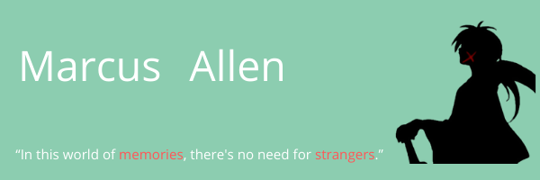

👋🏼 Hello! I've always enjoyed working with technology, ever since I was a little kid. In 2020 I gave up my career as a chef to start to learn programming, and it has been great ever since. The first project I ever worked on was for a fictional sushi restaurant ["The Sakoi"](https://cachemegifyoucan.github.io/SakoiWebsite/). Since then I have been fascinated with web development and programming, trying to learn and build as much as possible. Currently I am studying at [@Microverse](https://www.microverse.org) to become a Full Stack Developer. Besides programming I enjoy [📷 Music](https://www.youtube.com/channel/UCOJLc_BTPc2Yq8sJxDOCsog), Muay Thai, 🚶🏼‍♂️ hiking, and hanging out with friends.

### I know more about-  

### Some of the technologies I have worked with- 

    

    Here are some of my GitHub stats:
     
    
     
    Not including Private Repositories

